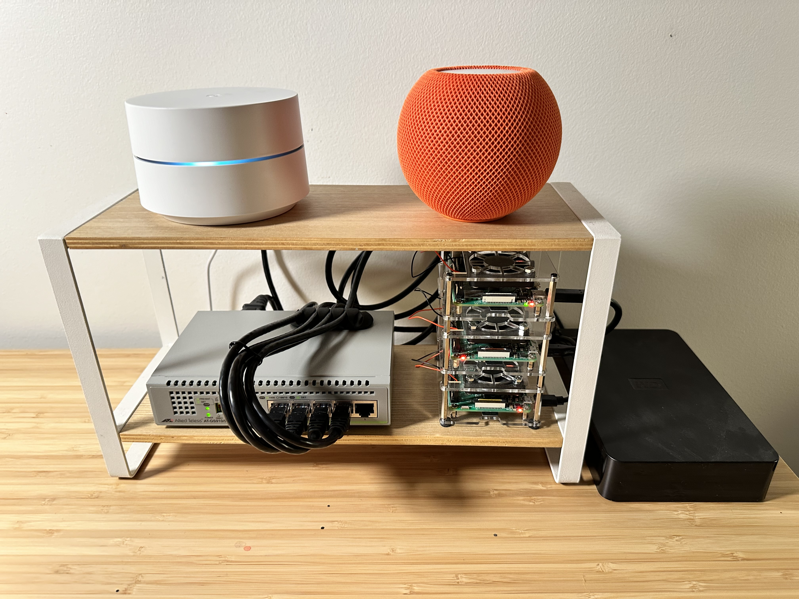

# Homecluster

Homecluster is my Kubernetes-based [homelab](https://en.wikipedia.org/wiki/Home_server). 

I use my homelab for learning, running fun things, and whatever I feel like. I chose Kubernetes in order to better learn and maintain a cluster over many years. I use [Talos](https://www.talos.dev/) to run Kubernetes on two Raspberry Pi 4s. I plan on expanding this with more nodes and a node specifically for running local LLMs in the future. A third Raspberry Pi 3 is runs a Postgres database. 

Running a homelab is a learning experience and I want to share what I learn with everyone else. I try to [document my work](./notebook) for my future self and for others.
